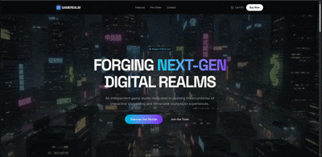

<div align="center">
  <h1>🎮 GameRealm</h1>
  <p>
    <strong>A production-quality React landing page for a next-gen gaming studio</strong>
  </p>
  <p>
    
    
    
    
    
  </p>
  <p>
    
    
    
  </p>
  <br />

  

  <br /><br />
  <p>
    <code>npm install && npm run dev</code>
  </p>
</div>

---

## 📋 Overview

**GameRealm** is a meticulously architected single-page application built to demonstrate professional-grade React engineering. It features a cinematic scroll-driven canvas animation, interactive game showcases, a tiered pre-order system, and fully responsive design — all organized around **SOLID principles** and **clean architecture**.

> This repository serves as a portfolio piece demonstrating modern frontend engineering practices — from file organization and component design to type safety and build tooling.

---

## 🏗️ Architecture

The project follows a **feature-based** folder structure that enforces separation of concerns and keeps each module laser-focused on a single responsibility.

```
src/
├── components/ui/          # Reusable primitives (AnimatedSection, SectionHeading, ErrorBoundary)
├── constants/              # Centralized data (games, editions, stats, navigation)
├── features/
│   ├── background/         # Scroll-driven canvas animation
│   ├── contact/            # Contact form with controlled state
│   ├── footer/             # Site footer with navigation
│   ├── games/              # Game cards, detail panel, catalog modal
│   ├── hero/               # Full-screen hero with animated entrance
│   ├── navigation/         # Fixed top navigation bar
│   ├── newsletter/         # Newsletter signup section
│   ├── preorder/           # Edition cards and payment options
│   └── stats/              # Animated statistics counter section
├── types/                  # Shared TypeScript interfaces
└── styles/                 # Global CSS with Tailwind 4
```

### Key design decisions

| Principle | Application |
|-----------|-------------|
| **Single Responsibility** | Each file owns exactly one concern — data lives in `constants/`, types in `types/`, components in `features/` |
| **Dependency Inversion** | Features depend on abstractions (`types/`, `constants/`) rather than concrete implementations |
| **Composition over Configuration** | Game cards, edition cards, and animated sections are composed from smaller primitives |
| **No Dead Code** | Zero unused components, imports, or dependencies. Every file is actively wired |
| **Zero Comments** | The code is self-documenting through descriptive naming and clear structure |

---

## ✨ Features & Engineering Highlights

### Scroll-driven Canvas Animation
Custom canvas engine that synchronizes a 240-frame image sequence with page scroll position — no third-party scroll libraries. Demonstrates: **Canvas 2D API** knowledge, **passive scroll event** optimization, **parallel image preloading** with Promise.all, and **requestAnimationFrame** batching for jank-free visual updates.

### Interactive Game Cards
Each game card reveals an animated detail panel with feature breakdowns and a direct pre-order CTA. Cards enter with staggered scroll-triggered animations. Demonstrates: **composition pattern** (GameCard → GameDetailPanel), **AnimatePresence** for mount/unmount transitions, and **local state management** over prop drilling.

### Tiered Pre-order System
Three edition tiers rendered from a data-driven model with a visually elevated recommended tier. Demonstrates: **data/presentation separation** (constants + EditionCard), **conditional styling** via props, and **declarative animation** with motion's whileInView.

### Controlled Contact Form
Fully controlled form with typed state interface, required field validation, and submit handling. Demonstrates: **controlled component** pattern, **typed event handlers**, and **form state management** without a library dependency.

### Error Resilience
A React Error Boundary class component catches runtime errors with a styled fallback UI. Demonstrates: **error boundary** pattern, **componentDidCatch** lifecycle, and **graceful degradation** for production deployments.

---

## 🛠️ Tech Stack

| Technology | Purpose |
|------------|---------|
| [React 19](https://react.dev/) | Component library with the latest concurrent features |
| [TypeScript](https://www.typescriptlang.org/) | Full type safety with strict mode, no `any` types |
| [Vite 6](https://vite.dev/) | Blazing-fast build tooling with HMR |
| [Tailwind CSS 4](https://tailwindcss.com/) | Utility-first styling with the `@theme` directive |
| [Motion.js 12](https://motion.dev/) | Declarative animations (the successor to Framer Motion) |
| [Lucide React](https://lucide.dev/) | Consistent icon set |

### Dependencies

A minimal, curated dependency footprint:

```json
"dependencies": {
  "lucide-react": "^0.546.0",
  "motion": "^12.23.24",
  "react": "^19.0.1",
  "react-dom": "^19.0.1"
}
```

Zero bloated dependencies. Zero SDKs. Zero generated artifacts.

---

## 🚀 Getting Started

```bash
# Install dependencies
npm install

# Start development server (port 3000)
npm run dev

# Production build
npm run build

# Type-check the entire codebase
npm run lint
```

---

## ✅ Quality Checks

| Command | What it does |
|---------|-------------|
| `npm run lint` | Runs `tsc --noEmit` — zero type errors guarantee |
| `npm run build` | Runs `vite build` — production bundle (≈113 KB gzip / 358 KB uncompressed) |
| `npm run clean` | Removes `dist/` directory |

---

## 📸 Project Structure Highlights

| File | Why it matters |
|------|---------------|
| `src/types/index.ts` | Centralized type definitions — no inline `interface` scatter |
| `src/constants/games.ts` | Feature data separated from presentation |
| `src/features/games/GameCard.tsx` | Self-contained game card with local expand state |
| `src/features/games/GameDetailPanel.tsx` | Focused detail view extracted from card |
| `src/features/games/AllGamesModal.tsx` | Reusable modal pattern |
| `src/components/ui/AnimatedSection.tsx` | Reusable scroll-reveal primitive with memoized motion component |
| `src/components/ui/ErrorBoundary.tsx` | Production-grade error resilience |
| `src/features/background/ScrollCanvasBackground.tsx` | Custom canvas animation engine |

---

## 🧠 Engineering Philosophy

- **No frameworks** for state management, routing, or data fetching — only what's needed
- **No dead code** — every export is consumed, every dependency is used
- **No comments** — clean naming replaces the need for inline explanations
- **No `any`** — TypeScript strict mode with full type coverage
- **Feature isolation** — adding a new section means creating a folder, not modifying existing files

---

<div align="center">
  <sub>Built with React 19, TypeScript, and Vite. Licensed under the MIT License.</sub>
</div>
